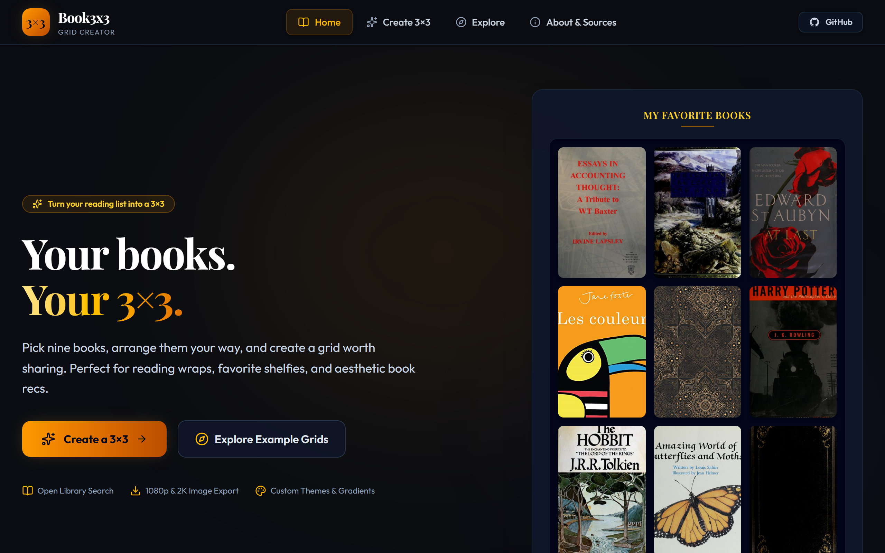
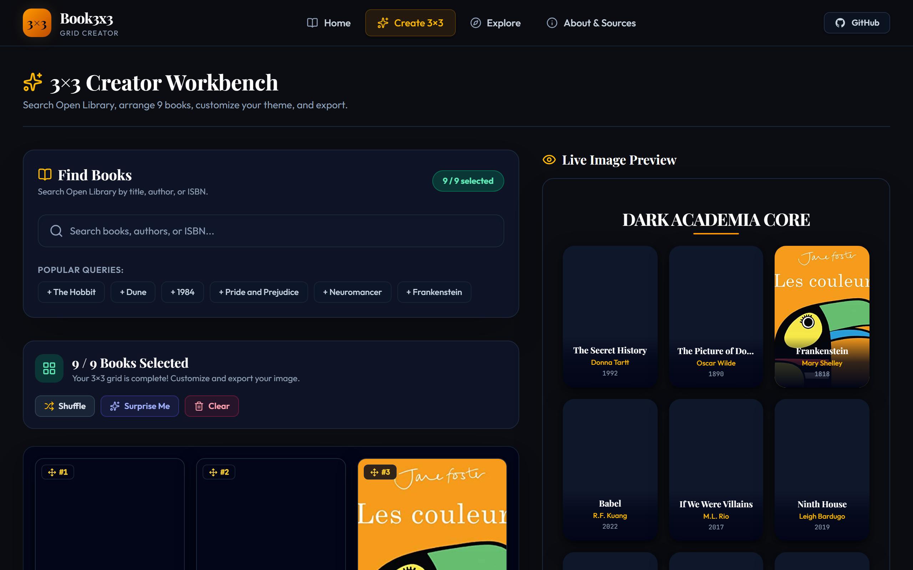
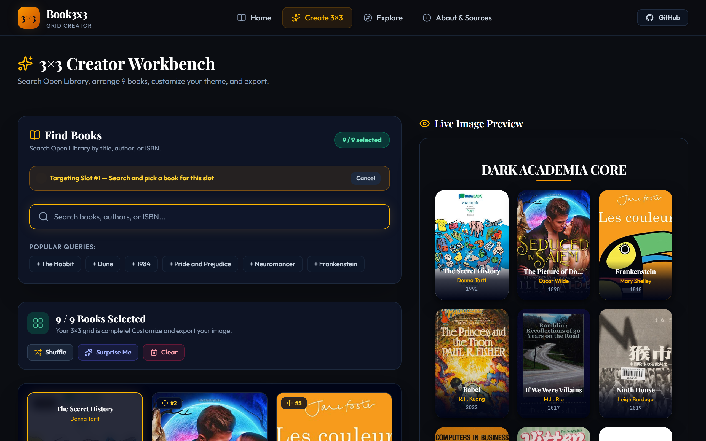

# Book3x3 📚✨

> **Turn your reading list into a 3×3.**
> Pick nine books. Arrange them your way. Make something worth sharing.

Book3x3 is a modern, client-side web application inspired by popular 3×3 aesthetic grid formats, designed specifically for readers and book lovers.

---

## 🌟 Live Demo

[https://katadox.github.io/Book3x3/](https://katadox.github.io/Book3x3/)

---

## 🎨 Screenshots & Visual Preview

### 1. Home Page & 3×3 Showcase


### 2. 3×3 Creator Workbench & Live Preview


### 3. Reactive Slot Search & Highlight


---

## ✨ Features

* **🔍 Open Library Search**: Search millions of titles, authors, or 13-digit ISBNs with debounced queries and fast result skeletons.
* **🎯 3×3 Grid Editor**: Select exactly 9 books into interactive slots with hover replacements and instant removals.
* **🖐️ Drag and Drop Reordering**: Drag books between cells on desktop or use a touch-friendly move modal on mobile devices.
* **🎨 5 Layout Presets**: Choose between *Classic*, *Minimal*, *Cinematic*, *Library*, and *Poster* visual themes.
* **🖼️ High-Resolution Export**: Render high-res PNG or JPG images at 1080×1080 or 2048×2048 directly in the browser with CORS fallback safety.
* **🚀 Web Share Integration**: Share your grid via the native Web Share API or copy a direct shareable link.
* **🔀 Quick Utilities**: Randomly *Shuffle* selected books, load preset *Surprise Me* grids, or *Clear Grid* with confirmation prompts.
* **💾 LocalStorage Persistence**: Automatically persists selected books, layout settings, titles, and fonts so your work is never lost.
* **🧭 Curated Explore Presets**: Load themed book sets ("Books That Changed My Life", "Essential High Fantasy", "Dark Academia Core", etc.) with one click.

---

## 🛠️ Tech Stack

* **React 18** — User Interface library
* **TypeScript** — Type safety and developer experience
* **Vite** — Fast frontend build tool
* **Tailwind CSS** — Modern utility-first CSS styling
* **HTML5 Canvas API** — Browser-based high-resolution image rendering
* **Lucide React** — Crisp iconography system

---

## 📖 Data Sources & Cover Artwork

Book metadata and cover artwork are retrieved dynamically using the **Open Library Search API** and **Open Library Covers API**.

### Copyright & Hosted Image Notice
* Cover images are displayed directly from Open Library's hosted Covers API (`https://covers.openlibrary.org/`).
* **No cover images are downloaded, stored, or bundled within this repository.**
* Book3x3 does not claim ownership of third-party cover artwork.
* All book cover artwork remains the property of its respective rights holders, authors, and publishers. Users should respect applicable copyright laws and provider terms.

---

## 🚀 Running Locally

Ensure you have Node.js (v18+) installed on your machine.

1. **Clone the repository**:
   ```bash
   git clone https://github.com/katadox/book3x3.git
   cd book9x9
   ```

2. **Install dependencies**:
   ```bash
   npm install
   ```

3. **Start local development server**:
   ```bash
   npm run dev
   ```

4. Open your browser and navigate to `http://localhost:5173`.

---

## 📦 Production Build

To test and compile the production bundle locally:

```bash
npm run build
```

The output static files will be placed in the `/dist` directory.

---


## 📄 License

This project is licensed under the [MIT License](LICENSE). Note that the MIT License applies strictly to the application's source code, not third-party book metadata or cover artwork.
